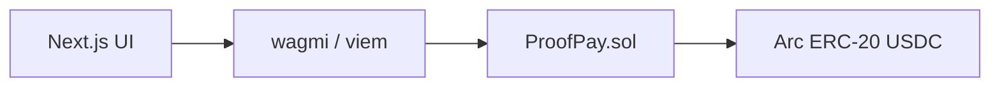

# Architecture

No backend or indexer is required: the browser reads the latest onchain task IDs, then each task from `ProofPay.sol`. Metadata remains onchain for this small MVP.

`lib/chain.ts` centralizes Arc settings and explorer links. `lib/proofpay.ts` centralizes ABI, enums and status labels. The immutable contract escrows ERC-20 USDC in raw six-decimal units. The native 18-decimal balance is only gas representation and is never added to ERC-20 balances.
